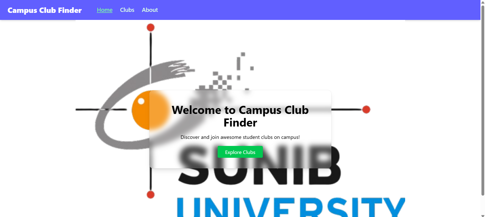

# Campus Club Finder

A responsive React web application that helps students browse, explore, and join various campus clubs.

---

## Tech Stack

- **React + Vite** – for fast, modern frontend development  
- **React Router** – for dynamic routing  
- **Tailwind CSS** – for utility-first styling  
- **LocalStorage** – for persistent "joined" club data  
- **TypeScript (for data structure)** – to define club data types

---

## Project Structure

src/
├── assets/ # Images for clubs
├── components/ # Reusable UI components (e.g., Navbar)
│ └── Navbar.jsx
├── data/ # Data definitions and club data (TypeScript)
│ └── data.ts
├── pages/ # Pages mapped to routes
│ ├── AboutPage.jsx
│ ├── ClubDetailPage.jsx
│ ├── ClubListPage.jsx
│ ├── HomePage.jsx
│ └── NotFoundPage.jsx
├── App.jsx # Application root with route setup
└── main.jsx # Entry point that renders App

- `assets/` contains static images used by the app.  
- `components/` holds shared UI elements used across pages.  
- `data/` contains club data and TypeScript type definitions.  
- `pages/` contains the main page components, each corresponds to a route.  
- `App.jsx` is the core app that sets up routes and layouts.  
- `main.jsx` bootstraps the React application.

---

## Features

- Home page with background image and intro  

- Club list with sorting and grid/list toggle  

- Club detail page with event list and "Join" button (saved with `localStorage`)  

- About page  

- 404 Page for undefined routes  

- Fully responsive layout for all devices

---
